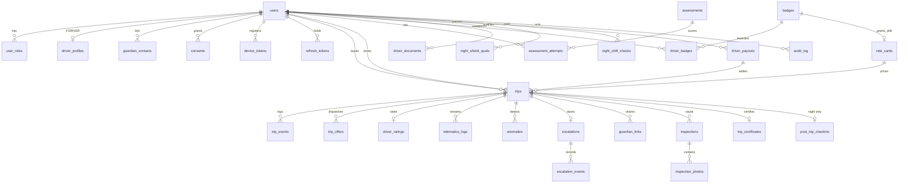

# MyDriver — Complete Database Plan

**Engine:** PostgreSQL 17 (TimescaleDB 2.17.2 image) · **Pooler:** PgBouncer (transaction mode) · **Cache/Bus:** Redis 7.4 · **Blobs:** S3

Last updated: 2026-09-17

---

## 0. Why relational, not MongoDB

There is **no MongoDB in this project** — no driver, no dependency, no
connection string. The system of record is PostgreSQL, and that is the correct
choice for this domain for four concrete reasons:

| Reason | What breaks without it |
|---|---|
| **The data is a graph, not a document tree** | A trip points at a customer, a driver, a rate card, an escalation, a certificate, a payout. A driver points at trips, badges, documents, assessments, payouts. No entity owns the rest, so whichever you pick as "the document", five others need to reference into it. |
| **Money needs multi-table ACID** | Marking a payout `PAID` must stamp `payout_id` onto exactly the trips it covers, in one transaction, or a trip gets paid twice. |
| **Referential integrity is a safety control** | An escalation pointing at a deleted trip is a blank screen for a Safety Desk agent during an L4 emergency. `REFERENCES trips(id)` makes that state unrepresentable. |
| **The audit ledger must be provably immutable** | Four tables carry `BEFORE UPDATE OR DELETE` triggers that raise. This is a guarantee no application bug can bypass — exactly what a court asks for when Trip Vault evidence is released under L5. |

The one genuinely non-relational workload — high-volume GPS/sensor telemetry
at ~11.5 billion rows/day — is handled by a **TimescaleDB hypertable**, which
is still PostgreSQL. Adding MongoDB would mean operating a second database to
serve the one workload Postgres already handles well.

---

## 1. Storage map — what lives where

Not everything belongs in Postgres. This is the deliberate split:

| Store | Holds | Durable? | Why here |
|---|---|---|---|
| **PostgreSQL** | All entities, all money, all audit ledgers, all state machines | Yes — system of record | Needs FKs, transactions, immutability triggers |
| **TimescaleDB hypertable** (same DB) | `telematics_logs` — GPS + accelerometer + gyro frames | Yes, 90-day retention | Time-series volume; compressed after 7 days |
| **Redis** | OTP rate limits, driver geo index (`GEOSEARCH`), WS fan-out pub/sub, last-known position, trip-role auth cache (5s TTL), dispatch claims | **No — cache only** | Hot path must not touch disk. If Redis is flushed the platform degrades; it does not lose data. |
| **S3** | Inspection photos, trip certificate PDFs, driver KYC documents, face reference images | Yes | Blobs never transit the database. Postgres stores the `storage_key` + SHA-256 only. |

**Rule:** if losing it would lose money, evidence, or safety history, it is in
Postgres. Redis holds nothing that cannot be rebuilt.

---

## 2. Current schema — 22 tables across 10 migrations

### 2.1 Identity & access — `0001`, `0002`, `0003`

#### `users`
The single account record. One human = one row, regardless of how many roles.

| Column | Type | Notes |
|---|---|---|
| `id` | UUID PK | `gen_random_uuid()` |
| `phone_number` | VARCHAR(16) UNIQUE | Nullable **only** for Google-first signup; required before booking or accepting a trip |
| `email` | CITEXT UNIQUE | Case-insensitive by type, not by application code |
| `full_name` | TEXT | |
| `google_sub` | TEXT UNIQUE | Google's subject claim |
| `phone_verified_at` | TIMESTAMPTZ | |
| `created_at` / `updated_at` | TIMESTAMPTZ | |

#### `user_roles`
Roles are **rows, not a column** — one person can be both a CUSTOMER and a
DRIVER, and an OPS_MANAGER can be suspended without deleting the account.

| Column | Type | Notes |
|---|---|---|
| `user_id, role` | UUID, `user_role` | Composite PK |
| `status` | `role_status` | `ACTIVE` \| `SUSPENDED` |
| `granted_at` | TIMESTAMPTZ | |

> **Privileged roles are not grantable over the API.** There is no endpoint
> that makes someone a `SAFETY_DESK_AGENT` — that would be a privilege-
> escalation surface. Provisioning is an operator action:
> `npm run grant-role -- +919000000001 SAFETY_DESK_AGENT`.

#### `otp_challenges`
| Column | Type | Notes |
|---|---|---|
| `id` | UUID PK | |
| `phone_number` | VARCHAR(16) | |
| `role` | `user_role` | OTP is scoped to the role being logged into |
| `code_hash` | TEXT | **Hashed.** The plaintext OTP is never stored |
| `expires_at` | TIMESTAMPTZ | |
| `attempts` | INT | Brute-force counter |
| `consumed_at` | TIMESTAMPTZ | Single-use enforcement |
| `request_ip` | INET | |

Partial index `idx_otp_live ON (phone_number) WHERE consumed_at IS NULL` —
"find the one live challenge" without scanning consumed history.

#### `refresh_tokens`
Rotating refresh tokens with **theft detection** via chain tracking.

| Column | Type | Notes |
|---|---|---|
| `id` | TEXT PK | SHA-256 of the selector — doubles as the lookup index |
| `user_id`, `role` | | |
| `token_hash` | TEXT | Hashed, like every credential here |
| `device_id` | TEXT | |
| `expires_at`, `revoked_at` | TIMESTAMPTZ | |
| `replaced_by` | TEXT | Forward pointer in the rotation chain |
| `chain_id` | UUID | Every token rotated from one login shares this. **Reuse of a rotated token means theft → revoke the whole chain.** |

### 2.2 Consent & guardians — `0004`

#### `guardian_contacts`
| Column | Type | Notes |
|---|---|---|
| `user_id`, `name`, `relation`, `phone` | | |
| `position` | SMALLINT | `CHECK (position BETWEEN 1 AND 3)` + `UNIQUE (user_id, position)` |

> **The three-guardian maximum is a database constraint, not an app rule.**
> It cannot be bypassed by any code path.

#### `consents`
DPDP-style consent ledger. Purposes: `LOCATION_TRACKING`,
`TELEMATICS_COLLECTION`, `GUARDIAN_SHARING`, `BIOMETRIC_LIVENESS`.

Rows are **never updated** — revocation sets `revoked_at`, and a re-grant
inserts a new row with a new `version`. The history is the point.

### 2.3 Drivers & pricing — `0005`

#### `driver_profiles`
| Column | Type | Notes |
|---|---|---|
| `user_id` | UUID PK → users | 1:1 with the account |
| `certifications` | TEXT[] | GIN-indexed. **Dispatch hot path** — see §4.1 |
| `night_shield_certified` | BOOLEAN | Currently a bare flag; §4.2 gives it a real lifecycle |
| `mydriver_score` | DECIMAL(5,2) | Default 100.00; dispatch orders by this |
| `rating`, `rating_count`, `total_trips` | | Denormalized counters |
| `vehicle_model`, `vehicle_plate` | TEXT | The **customer's** vehicle recorded at profile level |
| `availability` | `driver_availability` | `OFFLINE` \| `ONLINE` \| `ON_TRIP` |
| `face_reference_key` | TEXT | S3 key for liveness comparison |

#### `rate_cards`
Seeded skills — `MD-Standard` ₹16/km, `MD-Auto` ₹12, `MD-SUV` ₹22,
`MD-Lux` ₹35, `MD-Night` ₹19. `trips.required_certification` is a **foreign
key** to `skill_id`, so a trip can never request a skill that does not exist.

### 2.4 Trips — `0006`, `0010`

#### `trips`
The central entity. 40+ columns; grouped by concern:

| Group | Columns |
|---|---|
| **Parties** | `customer_id`, `driver_id` |
| **State** | `status` (`trip_status`), `booking_type`, `dispatch_round` |
| **Geography** | `pickup_lat/lng/address`, `drop_lat/lng/address`, `stops` JSONB, `return_stops` JSONB, `return_drop_*` |
| **Requirements** | `required_certification` → rate_cards, `speed_ceiling_kmh`, `hourly_package_hours`, `vehicle_specs` JSONB, `vision_mode`, `flight_number`, `requirement`, `trip_type` |
| **Security** | `pickup_handshake_otp_hash` (**hashed**), `handshake_attempts` |
| **Money** | `estimated_distance_km`, `estimated_fare`, `distance_km`, `duration_min`, `fare_amount`, `platform_fee`, `night_fee`, `driver_earnings` |
| **Cancellation** | `cancellation_reason`, `cancelled_by` |
| **Idempotency** | `idempotency_key` + unique partial index — a retried booking never double-books |
| **Timeline** | `requested_at`, `matched_at`, `handshake_at`, `started_at`, `completed_at`, `cancelled_at` |

Indexes worth knowing:
- **Keyset pagination** on `(customer_id, requested_at DESC, id DESC)` and the driver equivalent. **No `OFFSET` anywhere in this codebase** — offset pagination degrades linearly and this table is designed for billions of rows.
- **Partial active index** `WHERE status IN ('REQUESTED','MATCHED','HANDSHAKE_PENDING','IN_TRIP')` — the dispatch sweeper never scans history.

`CHECK` constraint: an `HOURLY` booking must have `hourly_package_hours`; a
`POINT_TO_POINT` must have a drop location. Enforced by the database.

#### `trip_events` — **append-only**
Immutable lifecycle ledger. `BEFORE UPDATE OR DELETE` trigger raises
`'trip_events is append-only'`.

#### `trip_offers`
| Constraint | Effect |
|---|---|
| `UNIQUE (trip_id) WHERE status = 'PENDING'` | **One live offer per trip.** Two drivers can never hold the same ride. |
| `INDEX (expires_at) WHERE status = 'PENDING'` | The expiry sweeper reads only live offers |

#### `driver_ratings`
`trip_id` is the **primary key** — one rating per trip, structurally. No
duplicate-rating logic needed in application code.

### 2.5 Telemetry — `0007` (TimescaleDB)

#### `telematics_logs` — hypertable
| Column | Type |
|---|---|
| `time` | TIMESTAMPTZ (partition key, 1-day chunks) |
| `trip_id` | UUID — **no FK, deliberately** |
| `source` | `DRIVER` \| `CUSTOMER` |
| `lat`, `lng`, `speed_kmh`, `heading`, `accel_z`, `gyro_z` | |

> **Why no foreign key:** at ~11.5 billion rows/day the referential check cost
> is prohibitive, and orphan telemetry is harmless. Integrity is enforced at
> the WebSocket gateway, which only accepts frames for a trip the sender
> participates in.

Lifecycle policies (mandatory at this volume, not optional):
- **Compress** after 7 days, segmented by `trip_id`, ordered by `time DESC`
- **Drop** after 90 days

### 2.6 Safety & escalation — `0008`

#### `anomalies`
Every automated detection. Reasons emitted by the integrity evaluator:
`SPEED_CEILING_BREACH`, `ROUTE_DEVIATION_EXCEEDED`, `TELEMETRY_LOST`.

`UNIQUE (trip_id, reason, window_start)` is the **idempotency backstop** that
makes anomaly raising safe across multiple backend instances; the Redis claim
is merely the fast path.

#### `escalations`
The L0–L5 ladder.

| Level | Meaning |
|---|---|
| L0 | Nominal — no action |
| L1 | Automated anomaly — guardians notified, event logged |
| L2 | Unacknowledged — queued to Safety Desk, **SLA clock running** |
| L3 | Human agent engaged — direct contact attempted |
| L4 | Emergency — silent SOS or confirmed danger |
| L5 | Law enforcement handoff — evidence packet released |

`AUTO_PROMOTE_AFTER_SECONDS = 120` · `SLA_SECONDS = 180` (the spec's "<3 min to human contact").

| Index | Purpose |
|---|---|
| `UNIQUE (trip_id) WHERE status <> 'RESOLVED'` | **One live incident per trip.** A second anomaly promotes the existing one rather than opening a competing incident. |
| `(level DESC, opened_at) WHERE status <> 'RESOLVED'` | The desk queue: worst first, then oldest |
| `(sla_deadline) WHERE status = 'OPEN'` | The SLA breach sweeper |

> **Levels only ever rise.** `assertPromotion()` rejects any downward move —
> a mistaken "all clear" must never bury a real emergency. The only way out is
> `RESOLVE`, a deliberate audited act by a named agent.

#### `escalation_events` — **append-only**
#### `guardian_links`
Shareable tracking links: `token_hash` (**hashed**, never the raw token),
`expires_at`, `revoked_at`, `views` counter.

#### `device_tokens`
FCM/APNs registrations. `UNIQUE (user_id, token)`.

#### `audit_log` — **append-only**
| Column | Type |
|---|---|
| `actor_id`, `actor_role`, `action`, `subject`, `payload` JSONB, `created_at` | |

**Reads are audited, not just writes.** Opening the live board writes
`VIEW_LIVE_BOARD`; opening an incident writes `VIEW_INCIDENT`. Viewing someone's
location is itself a privacy-relevant act.

### 2.7 Trip Vault — `0009`

#### `inspections`
`UNIQUE (trip_id, phase)` — exactly one `PRE` and one `POST` per ride.

#### `inspection_photos` — **append-only**
8 zones: `FRONT`, `REAR`, `LEFT`, `RIGHT`, `DASHBOARD`, `SEATS`,
`FUEL_ODOMETER`, `BOOT`.

| Column | Notes |
|---|---|
| `storage_key` | S3 — bytes never enter the DB |
| `sha256` | **Of the stored, watermarked bytes.** Any later edit changes the digest → tamper-evident |
| `bytes`, `lat`, `lng`, `captured_at`, `watermark` JSONB | |

`UNIQUE (inspection_id, zone)` — a zone is captured once; a retake replaces nothing.

#### `trip_certificates` — **append-only**
`cert_id` is the human-facing reference (`MV-2026-1A2B3C`), plus `storage_key`,
`sha256`, and the signed `payload` JSONB.

---

## 3. What the Admin Portal adds

Three new migrations. Everything below is new work.

### 3.1 `0011_driver_onboarding.sql` — testing, badges, documents, approval

This covers **"we take a test of drivers before registering them and give them
badges."**

#### `assessments` — the test catalogue

```sql
DO $$ BEGIN
  CREATE TYPE assessment_kind AS ENUM
    ('WRITTEN','PRACTICAL','LIVENESS','REACTION','DOCUMENT_REVIEW');
EXCEPTION WHEN duplicate_object THEN NULL; END $$;

CREATE TABLE IF NOT EXISTS assessments (
  id             UUID PRIMARY KEY DEFAULT gen_random_uuid(),
  code           TEXT NOT NULL UNIQUE,      -- 'MD-ROAD-RULES-V1'
  title          TEXT NOT NULL,
  kind           assessment_kind NOT NULL,
  passing_score  SMALLINT NOT NULL CHECK (passing_score BETWEEN 0 AND 100),
  max_attempts   SMALLINT NOT NULL DEFAULT 3,
  cooldown_hours SMALLINT NOT NULL DEFAULT 24,
  validity_days  SMALLINT,                  -- NULL = never expires
  questions      JSONB NOT NULL DEFAULT '[]'::jsonb,
  active         BOOLEAN NOT NULL DEFAULT true,
  created_at     TIMESTAMPTZ NOT NULL DEFAULT now()
);
```

`questions` is **JSONB on purpose** — it is a versioned document read as a
whole, never queried field-by-field, and never joined against. This is the one
place a document shape is genuinely the right model, and Postgres does JSONB
natively. A separate `questions` table would add a join to every test render
and buy nothing.

`code` is versioned (`-V1`) because **editing a live test invalidates past
scores**. A changed test is a new test.

#### `assessment_attempts` — every sitting, pass or fail

```sql
CREATE TABLE IF NOT EXISTS assessment_attempts (
  id            UUID PRIMARY KEY DEFAULT gen_random_uuid(),
  driver_id     UUID NOT NULL REFERENCES users(id) ON DELETE CASCADE,
  assessment_id UUID NOT NULL REFERENCES assessments(id),
  attempt_no    SMALLINT NOT NULL,
  score         SMALLINT CHECK (score BETWEEN 0 AND 100),
  passed        BOOLEAN,
  answers       JSONB NOT NULL DEFAULT '{}'::jsonb,
  evaluated_by  UUID REFERENCES users(id),   -- NULL = auto-scored
  notes         TEXT,
  started_at    TIMESTAMPTZ NOT NULL DEFAULT now(),
  submitted_at  TIMESTAMPTZ,
  CONSTRAINT attempt_unique UNIQUE (driver_id, assessment_id, attempt_no)
);

CREATE INDEX IF NOT EXISTS idx_attempts_driver
  ON assessment_attempts(driver_id, submitted_at DESC);
CREATE INDEX IF NOT EXISTS idx_attempts_grading
  ON assessment_attempts(assessment_id) WHERE submitted_at IS NOT NULL AND passed IS NULL;
```

Failed attempts are **kept, never deleted** — `max_attempts` and
`cooldown_hours` can only be enforced against a complete history. The second
index is the ops grading queue: submitted but not yet scored.

#### `badges` — the catalogue

```sql
CREATE TABLE IF NOT EXISTS badges (
  code          TEXT PRIMARY KEY,           -- 'MD-Night', 'MD-SUV', 'MD-Lux'
  label         TEXT NOT NULL,
  description   TEXT,
  icon          TEXT,
  grants_skill  TEXT REFERENCES rate_cards(skill_id),
  requires      TEXT[] NOT NULL DEFAULT '{}',  -- assessment codes
  validity_days SMALLINT,
  active        BOOLEAN NOT NULL DEFAULT true
);
```

`grants_skill` is the bridge: earning the `MD-SUV` badge is what puts
`MD-SUV` into `driver_profiles.certifications`, which is what lets dispatch
offer that driver an SUV trip. Badges are not decorative — they are the
authorisation mechanism.

#### `driver_badges` — the award ledger

```sql
CREATE TABLE IF NOT EXISTS driver_badges (
  id                UUID PRIMARY KEY DEFAULT gen_random_uuid(),
  driver_id         UUID NOT NULL REFERENCES users(id) ON DELETE CASCADE,
  badge_code        TEXT NOT NULL REFERENCES badges(code),
  awarded_at        TIMESTAMPTZ NOT NULL DEFAULT now(),
  awarded_by        UUID REFERENCES users(id),
  source_attempt_id UUID REFERENCES assessment_attempts(id),
  expires_at        TIMESTAMPTZ,
  revoked_at        TIMESTAMPTZ,
  revoke_reason     TEXT
);

CREATE UNIQUE INDEX IF NOT EXISTS idx_driver_badge_live
  ON driver_badges(driver_id, badge_code) WHERE revoked_at IS NULL;
CREATE INDEX IF NOT EXISTS idx_driver_badges_expiring
  ON driver_badges(expires_at) WHERE revoked_at IS NULL AND expires_at IS NOT NULL;
```

**The partial unique index is the important one:** a driver holds each badge
at most once *live*, but revoked awards stay in the table as history. A
re-earned badge is a new row, so "this driver lost MD-Night in March and
re-qualified in June" is answerable.

##### Ledger vs. hot path — a deliberate denormalization

`driver_profiles.certifications TEXT[]` already exists, is GIN-indexed, and is
read on **every dispatch query** (`geo-index.ts:91`). Replacing it with a join
to `driver_badges` would put a join on the hot matching path.

So: **`driver_badges` is the authority; `certifications` is a projection of
it**, rewritten whenever a badge is awarded, revoked, or expires. The
expiry sweeper and the award/revoke service are the only writers.

> `-- ponytail: certifications[] is a denormalized projection of driver_badges.`
> `-- Rebuild it from the ledger if they ever drift; the ledger wins.`

#### `driver_documents` — KYC

```sql
DO $$ BEGIN
  CREATE TYPE document_kind AS ENUM
    ('DRIVING_LICENCE','AADHAAR','POLICE_VERIFICATION','PHOTO','ADDRESS_PROOF');
EXCEPTION WHEN duplicate_object THEN NULL; END $$;

DO $$ BEGIN
  CREATE TYPE document_status AS ENUM ('SUBMITTED','VERIFIED','REJECTED','EXPIRED');
EXCEPTION WHEN duplicate_object THEN NULL; END $$;

CREATE TABLE IF NOT EXISTS driver_documents (
  id            UUID PRIMARY KEY DEFAULT gen_random_uuid(),
  driver_id     UUID NOT NULL REFERENCES users(id) ON DELETE CASCADE,
  kind          document_kind NOT NULL,
  storage_key   TEXT NOT NULL,
  number_last4  VARCHAR(4),
  expires_on    DATE,
  status        document_status NOT NULL DEFAULT 'SUBMITTED',
  reviewed_by   UUID REFERENCES users(id),
  reviewed_at   TIMESTAMPTZ,
  reject_reason TEXT,
  created_at    TIMESTAMPTZ NOT NULL DEFAULT now()
);

CREATE INDEX IF NOT EXISTS idx_documents_driver ON driver_documents(driver_id, created_at DESC);
CREATE INDEX IF NOT EXISTS idx_documents_queue  ON driver_documents(status) WHERE status = 'SUBMITTED';
CREATE INDEX IF NOT EXISTS idx_documents_expiry ON driver_documents(expires_on) WHERE status = 'VERIFIED';
```

- **`number_last4` only — never the full Aadhaar or licence number.** Storing
  full government IDs creates breach liability with no operational benefit: a
  reviewer verifies against the image, and last-4 is enough to match a record
  afterwards.
- **Not `UNIQUE (driver_id, kind)`** — a rejected licence gets resubmitted, and
  the rejection history is what an audit actually wants.
- `idx_documents_expiry` drives the nightly job that expires a driver whose
  licence lapsed. A licence with an expiry date nothing checks is not a control.

#### Approval state on `driver_profiles`

```sql
DO $$ BEGIN
  CREATE TYPE onboarding_status AS ENUM
    ('PENDING','TESTING','UNDER_REVIEW','APPROVED','REJECTED','SUSPENDED');
EXCEPTION WHEN duplicate_object THEN NULL; END $$;

ALTER TABLE driver_profiles
  ADD COLUMN IF NOT EXISTS onboarding_status onboarding_status NOT NULL DEFAULT 'APPROVED',
  ADD COLUMN IF NOT EXISTS reviewed_by UUID REFERENCES users(id),
  ADD COLUMN IF NOT EXISTS reviewed_at TIMESTAMPTZ,
  ADD COLUMN IF NOT EXISTS review_note TEXT,
  ADD COLUMN IF NOT EXISTS onboarded_at TIMESTAMPTZ;   -- tenure clock, see §3.2

ALTER TABLE driver_profiles ALTER COLUMN onboarding_status SET DEFAULT 'PENDING';

CREATE INDEX IF NOT EXISTS idx_driver_onboarding
  ON driver_profiles(onboarding_status) WHERE onboarding_status <> 'APPROVED';
```

> **The default flips *after* the backfill.** Adding the column with
> `DEFAULT 'PENDING'` would instantly suspend every existing seeded driver.
> Existing rows land on `APPROVED`; only new signups land on `PENDING`.

The onboarding flow: `PENDING` → (docs uploaded) `TESTING` → (tests passed)
`UNDER_REVIEW` → ops decision → `APPROVED` | `REJECTED`.

### 3.2 `0012_night_shield.sql` — Night Shield operations

The presentation deck defines Night Shield as **a hard operating protocol, not
a feature toggle**, active 22:00–05:00, with these rules:

| Rule | Where it is enforced |
|---|---|
| 6+ months tenure **and** score ≥ 85 | `night_shield_quals` issuance check |
| Re-verified every 90 days | `expires_at` + nightly sweeper |
| Shift-start liveness + reaction test | `night_shift_checks`, gates going ONLINE |
| Real-time live board monitoring | Existing Safety Desk (built) |
| Triple volume-button silent SOS | Existing `POST /v1/trips/:id/sos` → L4 (built) |
| 10-min post-drop check-in call | `post_trip_checkins` |

Today `driver_profiles.night_shield_certified` is a bare boolean with no
issuer, no expiry, and no revocation path. These tables give it a lifecycle.

#### `night_shield_quals` — the 90-day re-verification ledger

```sql
CREATE TABLE IF NOT EXISTS night_shield_quals (
  id                  UUID PRIMARY KEY DEFAULT gen_random_uuid(),
  driver_id           UUID NOT NULL REFERENCES users(id) ON DELETE CASCADE,
  qualified_at        TIMESTAMPTZ NOT NULL DEFAULT now(),
  expires_at          TIMESTAMPTZ NOT NULL,      -- qualified_at + 90 days
  tenure_days_at_check INT NOT NULL,
  score_at_check      DECIMAL(5,2) NOT NULL,
  verified_by         UUID REFERENCES users(id),
  revoked_at          TIMESTAMPTZ,
  revoke_reason       TEXT,
  CONSTRAINT nss_tenure CHECK (tenure_days_at_check >= 180),
  CONSTRAINT nss_score  CHECK (score_at_check >= 85.00)
);

CREATE UNIQUE INDEX IF NOT EXISTS idx_nss_live
  ON night_shield_quals(driver_id) WHERE revoked_at IS NULL;
CREATE INDEX IF NOT EXISTS idx_nss_expiring
  ON night_shield_quals(expires_at) WHERE revoked_at IS NULL;
```

> **The two `CHECK` constraints are the point.** "6+ months tenure and score
> ≥ 85" is written into the database, so no admin screen, no script, and no
> future code path can issue a Night Shield qualification to a driver who does
> not meet it. `tenure_days_at_check` and `score_at_check` are **snapshots** —
> they record what was true at issuance, which is what an incident review needs.

`idx_nss_expiring` drives the nightly re-verification sweeper. A 90-day expiry
that nothing enforces is a comment, not a control.

#### `night_shift_checks` — shift-start gate

```sql
CREATE TABLE IF NOT EXISTS night_shift_checks (
  id                  UUID PRIMARY KEY DEFAULT gen_random_uuid(),
  driver_id           UUID NOT NULL REFERENCES users(id) ON DELETE CASCADE,
  shift_date          DATE NOT NULL,
  liveness_confidence DECIMAL(4,3),
  liveness_passed     BOOLEAN NOT NULL DEFAULT false,
  reaction_ms         INT,
  reaction_passed     BOOLEAN NOT NULL DEFAULT false,
  passed              BOOLEAN GENERATED ALWAYS AS
                        (liveness_passed AND reaction_passed) STORED,
  selfie_key          TEXT,
  created_at          TIMESTAMPTZ NOT NULL DEFAULT now(),
  CONSTRAINT nsc_one_per_shift UNIQUE (driver_id, shift_date)
);

CREATE INDEX IF NOT EXISTS idx_nsc_today ON night_shift_checks(shift_date, passed);
```

`passed` is a **generated column** — it cannot drift from its inputs, because
Postgres computes it. Writing it by hand in two services is how a driver ends
up online with a failed liveness check.

`liveness_confidence` feeds from the existing `LivenessProvider` interface
(`src/providers/liveness/index.ts`), which currently ships a mock. The schema
does not care which vendor lands.

> `shift_date` is the **operating night**, not the calendar date — a shift
> beginning 23:40 and one beginning 01:20 belong to the same night. The service
> computes it as `(now - 5 hours)::date` so the 22:00–05:00 window maps to one
> row.

#### `post_trip_checkins` — the 10-minute call

```sql
DO $$ BEGIN
  CREATE TYPE checkin_outcome AS ENUM
    ('PENDING','SAFE','NO_ANSWER','NEEDS_FOLLOWUP','ESCALATED');
EXCEPTION WHEN duplicate_object THEN NULL; END $$;

CREATE TABLE IF NOT EXISTS post_trip_checkins (
  trip_id       UUID PRIMARY KEY REFERENCES trips(id) ON DELETE CASCADE,
  due_at        TIMESTAMPTZ NOT NULL,       -- completed_at + 10 minutes
  called_at     TIMESTAMPTZ,
  agent_id      UUID REFERENCES users(id),
  outcome       checkin_outcome NOT NULL DEFAULT 'PENDING',
  notes         TEXT,
  escalation_id UUID REFERENCES escalations(id),
  created_at    TIMESTAMPTZ NOT NULL DEFAULT now()
);

CREATE INDEX IF NOT EXISTS idx_checkins_due
  ON post_trip_checkins(due_at) WHERE outcome = 'PENDING';
```

`trip_id` as PK means one check-in per trip, structurally. The partial index is
the Safety Desk work queue — "who is due a call right now" without scanning
resolved check-ins. `escalation_id` links the case where a `NO_ANSWER` becomes
a real incident.

A row is inserted **only for night trips**, when a trip completes inside the
22:00–05:00 window. Day trips get no row, so the queue stays small.

#### Night Shield in dispatch

`night_shield_certified` stays as the denormalized hot-path flag, projected
from `night_shield_quals` exactly as `certifications[]` is projected from
`driver_badges`.

### 3.3 `0013_admin_finance.sql` — payout reconciliation

`trips` already carries `fare_amount`, `platform_fee`, `night_fee`, and
`driver_earnings`. A payout is a **grouping over rows that already exist** — no
new money fields.

```sql
DO $$ BEGIN
  CREATE TYPE payout_status AS ENUM ('PENDING','APPROVED','PAID','FAILED');
EXCEPTION WHEN duplicate_object THEN NULL; END $$;

CREATE TABLE IF NOT EXISTS driver_payouts (
  id           UUID PRIMARY KEY DEFAULT gen_random_uuid(),
  driver_id    UUID NOT NULL REFERENCES users(id),
  period_start DATE NOT NULL,
  period_end   DATE NOT NULL,
  trip_count   INT NOT NULL,
  gross        DECIMAL(12,2) NOT NULL,
  platform_fee DECIMAL(12,2) NOT NULL,
  net          DECIMAL(12,2) NOT NULL,
  status       payout_status NOT NULL DEFAULT 'PENDING',
  reference    TEXT,
  approved_by  UUID REFERENCES users(id),
  paid_at      TIMESTAMPTZ,
  created_at   TIMESTAMPTZ NOT NULL DEFAULT now(),
  CONSTRAINT payout_period CHECK (period_end >= period_start),
  CONSTRAINT payout_net    CHECK (net = gross - platform_fee)
);

ALTER TABLE trips ADD COLUMN IF NOT EXISTS payout_id UUID REFERENCES driver_payouts(id);

CREATE INDEX IF NOT EXISTS idx_trips_unpaid
  ON trips(driver_id, completed_at)
  WHERE payout_id IS NULL AND status = 'COMPLETED';
```

**`trips.payout_id` is the actual double-payment guard.** A
`UNIQUE (driver_id, period_start, period_end)` would *not* prevent it — two
overlapping periods would each legitimately claim the same trip. Stamping the
trip row makes "paid" a property of the trip, not an inference from dates.

Generating a payout is one transaction:

```sql
BEGIN;
  INSERT INTO driver_payouts (driver_id, period_start, period_end, trip_count, gross, platform_fee, net)
  SELECT $1, $2, $3, COUNT(*), SUM(driver_earnings), SUM(platform_fee),
         SUM(driver_earnings) - SUM(platform_fee)
    FROM trips
   WHERE driver_id = $1 AND status = 'COMPLETED' AND payout_id IS NULL
     AND completed_at >= $2 AND completed_at < $3
  RETURNING id;

  UPDATE trips SET payout_id = $4
   WHERE driver_id = $1 AND status = 'COMPLETED' AND payout_id IS NULL
     AND completed_at >= $2 AND completed_at < $3;
COMMIT;
```

The `payout_id IS NULL` predicate makes it **idempotent under concurrency**: a
second run claims zero trips. This is precisely the transaction a document
store would force you to implement by hand, and get wrong.

---

## 4. Invariants the database enforces (not the application)

These are the guarantees that survive any application bug:

| Invariant | Mechanism |
|---|---|
| Audit history cannot be rewritten | `BEFORE UPDATE OR DELETE` triggers on `audit_log`, `trip_events`, `escalation_events`, `inspection_photos`, `trip_certificates` |
| Max 3 guardians per user | `CHECK (position BETWEEN 1 AND 3)` + `UNIQUE (user_id, position)` |
| One live offer per trip | `UNIQUE (trip_id) WHERE status = 'PENDING'` |
| One live escalation per trip | `UNIQUE (trip_id) WHERE status <> 'RESOLVED'` |
| One rating per trip | `trip_id` is the PK |
| One PRE + one POST inspection per trip | `UNIQUE (trip_id, phase)` |
| One photo per inspection zone | `UNIQUE (inspection_id, zone)` |
| Retried bookings never double-book | `UNIQUE (customer_id, idempotency_key)` partial |
| Anomalies are idempotent across instances | `UNIQUE (trip_id, reason, window_start)` |
| A trip cannot request a nonexistent skill | `required_certification` FK → `rate_cards` |
| Hourly needs hours; P2P needs a drop | `CHECK` on `trips` |
| **Night Shield needs 6mo + score 85** | `CHECK` on `night_shield_quals` |
| **A driver holds each badge once, live** | `UNIQUE (driver_id, badge_code) WHERE revoked_at IS NULL` |
| **One Night Shield qual live per driver** | `UNIQUE (driver_id) WHERE revoked_at IS NULL` |
| **One shift check per driver per night** | `UNIQUE (driver_id, shift_date)` |
| **A trip is paid at most once** | `trips.payout_id` + `WHERE payout_id IS NULL` |
| **Payout arithmetic is consistent** | `CHECK (net = gross - platform_fee)` |

## 4.1 One dispatch gate, one place — ✅ APPLIED

`src/modules/trips/geo-index.ts:91` holds the **single** eligibility query that
every dispatch path routes through. All new gates go here, and only here.

> Applied in `geo-index.ts`, with the Night Shield flag passed from
> `matching.ts`. See "What this changed" below.

The query as it now stands:

```sql
SELECT user_id FROM driver_profiles
 WHERE user_id = ANY($1::uuid[])
   AND availability = 'ONLINE'
   AND $2 = ANY(certifications)
   AND onboarding_status = 'APPROVED'              -- 0011
   AND (NOT $4 OR night_shield_certified)          -- 0012, $4 = is night trip
 ORDER BY mydriver_score DESC
 LIMIT $3
```

Adding the guard in each caller instead would be a larger diff **and** would
leave every sibling caller broken. A badge, an approval flag, or a Night Shield
qualification that dispatch does not read is decoration, not a control.

### What this changed

`ensureDriverProfile()` (`src/modules/trips/rate-cards.ts`) creates a
`driver_profiles` row on driver signup, which after `0011` defaults to
`PENDING`. So a newly signed-up driver is now undispatchable until ops approves
them in the portal — the intended behaviour.

Two accommodations, both deliberate:

- **Existing drivers are unaffected.** `0011` backfills every current row to
  `APPROVED` before flipping the column default.
- **Development auto-approves.** `ensureDriverProfile()` inserts `APPROVED`
  when `NODE_ENV === 'development'`, so `npm run dev` stays usable for anyone
  testing the driver app locally. `test` keeps the real default, so the gate
  itself stays under test.

`tests/integration/onboarding-gate.test.ts` asserts that a driver who is
online, positioned and correctly certified is still not dispatched in any of
`PENDING`, `TESTING`, `UNDER_REVIEW`, `REJECTED` or `SUSPENDED`, and that an
admin suspension takes effect mid-shift without a re-index.

**Night Shield note:** because dispatch now filters on `night_shield_certified`
inside the 22:00–05:00 window, the test helper certifies its drivers. Without
that the suite would pass by day and fail at night — a time-dependent flake.

---

## 5. Retention & privacy

| Data | Retention | Basis |
|---|---|---|
| `telematics_logs` | **90 days**, compressed after 7 | Automatic Timescale policy |
| `otp_challenges` | Purge consumed rows > 30 days | Nothing of value after use |
| `refresh_tokens` | Purge expired > 90 days | Keep enough to detect chain reuse |
| `audit_log` | **Indefinite** | Legal/regulatory; append-only |
| `trip_certificates`, `inspection_photos` | **Indefinite** | Evidence |
| `assessment_attempts` | Indefinite | Needed to enforce `max_attempts` |
| `driver_documents` (S3 blobs) | Delete 90 days after driver offboarding | Minimisation |

Credential and PII rules already in force, extended by the new tables:

- **Everything credential-shaped is hashed**, never stored raw: OTP codes,
  refresh tokens, guardian link tokens, pickup handshake OTPs.
- **Government ID numbers are never stored in full** — `number_last4` only.
- **Consent is a ledger, not a flag** — revocation appends, never deletes.
- **Viewing is auditable**, not just acting: `VIEW_LIVE_BOARD`,
  `VIEW_INCIDENT`, and (new) `VIEW_DOCUMENT` for KYC images.

---

## 6. Entity relationships



---

## 6.5 Verification status — all checks executed

Run against a real PostgreSQL 17 / TimescaleDB instance on 2026-09-18.

| Item | Status |
|---|---|
| `0001`–`0013` migrations | ✅ **All 13 applied cleanly** |
| Seed (rate cards, assessments, badges) | ✅ 5 rate cards, 7 assessments, 5 badges |
| Table count | ✅ 31 tables (+ `_migrations`) |
| Backend typecheck | ✅ `tsc --noEmit` clean |
| Website build + lint | ✅ `vite build` clean, no new errors |
| Unit tests | ✅ 69/69 passing |
| Full suite | ✅ 275/275 passing |
| Dispatch guard | ✅ Applied, 9 dedicated tests |
| Privilege-escalation fix | ✅ 8 dedicated tests |

### Constraints proven, not just written

Each of these was executed against the live database and produced the error it
was designed to produce:

| Check | Result |
|---|---|
| New `driver_profiles` row defaults to `PENDING` | ✅ returned `PENDING` |
| `night_shield_quals` rejects tenure of 100 days | ✅ `violates check constraint "nss_tenure"` |
| `night_shield_quals` rejects score of 80 | ✅ `violates check constraint "nss_score"` |
| `night_shield_quals` accepts 400 days / score 95 | ✅ inserted |
| Second live qualification for one driver | ✅ `duplicate key ... "idx_nss_live"` |
| `night_shift_checks.passed` with one sub-check failing | ✅ computed `false` |
| `driver_payouts` with `net ≠ gross − fee` | ✅ `violates check constraint "payout_net"` |
| `UPDATE audit_log` | ✅ `audit_log is append-only` |

Reproduce with:

```bash
cd prototype/backend
npm run infra:up && npm run db:migrate && npm run db:seed && npm test
```

> The suite is sensitive to machine load: a run competing with a build shows
> `beforeEach` hook timeouts in `trips-lifecycle`, `trips-quote-book` and
> `vault`. Those same files pass on an unloaded machine. If you see hook
> timeouts, re-run before investigating — it is contention, not logic.

---

## 7. Table count

| Migration | Tables | Status |
|---|---|---|
| `0001`–`0010` | 22 | **Built** |
| `0011_driver_onboarding` | +5 (`assessments`, `assessment_attempts`, `badges`, `driver_badges`, `driver_documents`) + 5 cols on `driver_profiles` | Planned |
| `0012_night_shield` | +3 (`night_shield_quals`, `night_shift_checks`, `post_trip_checkins`) | Planned |
| `0013_admin_finance` | +1 (`driver_payouts`) + 1 col on `trips` | Planned |
| **Total** | **31 tables** | |

## 8. Deliberately not modelled

| Skipped | Why | Add when |
|---|---|---|
| `payments` | No payment gateway exists anywhere in the backend. A schema now is guesswork about a vendor's webhook shape. | A gateway is chosen |
| `corporate_accounts` | The spec mentions B2B but nothing in the codebase references a corporate customer. | The first corporate deal is real |
| `vehicles` / fleet | `driver_profiles.vehicle_model/plate` exists, and MyDriver drives the **customer's** car — a fleet table may model the wrong thing entirely. | The ownership model is settled |
| `admin_audit` | `audit_log` already does this, append-only, trigger-enforced. | Never — reuse it |
| `agent_shifts` | `user_roles` covers who may sit at the desk. Rostering is an HR problem, not a safety one. | Someone asks for rostering |
| Separate `questions` table | `assessments.questions` JSONB is read whole, never joined. A table would add a join to every test render. | Questions need cross-test analytics |
