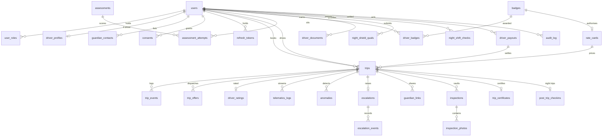

# MyDriver — Database Schema

**Prepared for technical review**
Date: 17 September 2026

| | |
|---|---|
| **Database** | PostgreSQL 17 |
| **Extension** | TimescaleDB 2.17.2 (time-series telemetry) |
| **Connection pooler** | PgBouncer, transaction mode |
| **Cache / message bus** | Redis 7.4 *(non-durable — cache only)* |
| **Object storage** | Amazon S3 *(photos, PDFs, documents)* |
| **Schema version** | 14 migrations · 31 tables |

---

## 1. Summary

MyDriver is a driver-on-demand platform where a vetted driver operates the
customer's own vehicle, with a 24×7 Safety Desk monitoring every trip in real
time. The data model covers six domains: identity and access, driver
qualification, trip lifecycle, safety and escalation, evidence (Trip Vault),
and finance.

**The entire system of record is a single relational database — PostgreSQL.**
No document store is used anywhere in the platform.

Of the 31 tables, **22 are implemented and running**; **9 are specified for
the Admin Portal** and are the subject of the second half of this document.

---

## 2. Why the model is relational

This was evaluated explicitly. A relational database is the correct choice for
this domain, for four reasons that are specific to what this platform does.

### 2.1 The data is a graph, not a hierarchy of documents

A document database works well when data forms independent trees with a clear
owning root. This domain does not have that shape.

A **trip** references a customer, a driver, a rate card, an escalation, an
inspection, a certificate, and a payout. A **driver** references trips,
badges, assessment attempts, KYC documents, qualifications, and payouts. The
same escalation is read by the Safety Desk queue, the trip timeline, and the
audit ledger.

No entity owns the others. Whichever entity were chosen as "the document",
five or six others would need to reference into it — which means either
duplicating data across documents and keeping the copies in sync manually, or
performing joins in application code that the database is designed to do.

### 2.2 Financial operations require multi-table transactions

Settling a driver payout must do two things atomically: create the payout
record, and mark the exact set of trips it covers as settled. If the first
succeeds and the second fails, those trips are paid again in the next cycle.

PostgreSQL provides this as a single `BEGIN … COMMIT` with a foreign-key
guarantee. The operation is also idempotent by construction — a repeated run
matches zero unsettled rows and produces no duplicate. This correctness comes
from the database, not from application code that must be written correctly
every time.

### 2.3 Referential integrity is a safety control

An escalation that references a trip which no longer exists presents a Safety
Desk agent with a blank screen during a live emergency. A trip that references
a service class that was deleted cannot be priced.

Foreign key constraints make these states **impossible to represent**, rather
than merely unlikely. In a safety-critical system this is a control, not a
convenience.

### 2.4 The audit trail must be provably immutable

Five tables in this schema carry database-level triggers that reject any
`UPDATE` or `DELETE`:

`audit_log` · `trip_events` · `escalation_events` · `inspection_photos` · `trip_certificates`

This is enforced inside the database engine. No application bug, no
administrator, and no future code change can rewrite this history. When
evidence is released to law enforcement under an L5 escalation, this property
is what makes the record defensible.

### 2.5 The one time-series workload

The single genuinely non-relational workload is GPS and sensor telemetry —
approximately 11.5 billion rows per day at full scale. This is handled by a
**TimescaleDB hypertable**, which is a PostgreSQL extension, not a separate
database. It is automatically partitioned by day, compressed after 7 days, and
dropped after 90.

Introducing a second database engine to serve this one workload would add
operational burden without solving a problem PostgreSQL does not already
solve.

---

## 3. Storage allocation

Not all data belongs in the relational store. The division is deliberate.

| Store | Contents | Durable | Rationale |
|---|---|:---:|---|
| **PostgreSQL** | All entities, all financial records, all audit ledgers, all state machines | Yes | Requires foreign keys, transactions, immutability |
| **TimescaleDB hypertable** *(same database)* | GPS, speed, accelerometer, gyroscope frames | Yes, 90 days | Time-series volume and automatic compression |
| **Redis** | Rate limits, driver geospatial index, WebSocket fan-out, last-known position, short-lived authorisation cache | **No** | Hot-path latency. If Redis is lost the platform degrades; no data is lost. |
| **Amazon S3** | Inspection photographs, certificate PDFs, KYC documents, biometric reference images | Yes | Binary objects never enter the database; PostgreSQL stores the object key and a SHA-256 digest |

**Governing rule:** if losing the data would lose money, evidence, or safety
history, it is in PostgreSQL. Redis holds nothing that cannot be rebuilt from
PostgreSQL.

---

## 4. Implemented schema — 22 tables

### 4.1 Identity and access

#### `users`
One row per person, regardless of how many roles they hold.

| Column | Type | Notes |
|---|---|---|
| `id` | UUID PK | |
| `phone_number` | VARCHAR(16) UNIQUE | Nullable only for Google-first signup |
| `email` | CITEXT UNIQUE | Case-insensitive at the type level |
| `full_name` | TEXT | |
| `google_sub` | TEXT UNIQUE | Google OAuth subject identifier |
| `phone_verified_at` | TIMESTAMPTZ | |
| `password_hash` | TEXT | Staff only (scrypt). `NULL` for customers and drivers, who use OTP / Google |
| `created_at`, `updated_at` | TIMESTAMPTZ | |

#### `user_roles`
Roles are stored as rows rather than a column, so one person can hold several
(a customer who is also a driver), and any single role can be suspended
without affecting the account.

| Column | Type | Notes |
|---|---|---|
| `user_id`, `role` | UUID, `user_role` | Composite primary key |
| `status` | `role_status` | `ACTIVE` / `SUSPENDED` |
| `granted_at` | TIMESTAMPTZ | |

Roles: `CUSTOMER`, `DRIVER`, `AGENT`, `ADMIN`, `SAFETY_DESK_AGENT`,
`OPS_MANAGER`, `FINANCE`, `SUPER_ADMIN`.

> **Privileged roles cannot be granted through the API.** There is no endpoint
> that makes a user a Safety Desk agent, because such an endpoint would be a
> privilege-escalation surface. Provisioning is a deliberate operator action
> performed through a command-line tool, and is itself written to the audit log.

#### `otp_challenges`
One-time password challenges for phone login.

| Column | Type | Notes |
|---|---|---|
| `id` | UUID PK | |
| `phone_number` | VARCHAR(16) | |
| `role` | `user_role` | Challenge is scoped to the role being accessed |
| `code_hash` | TEXT | **Hashed.** The plaintext code is never stored |
| `expires_at` | TIMESTAMPTZ | |
| `attempts` | INT | Brute-force counter |
| `consumed_at` | TIMESTAMPTZ | Enforces single use |
| `request_ip` | INET | |

#### `refresh_tokens`
Rotating refresh tokens with theft detection.

| Column | Type | Notes |
|---|---|---|
| `id` | TEXT PK | SHA-256 of the selector |
| `user_id`, `role` | | |
| `token_hash` | TEXT | Hashed |
| `device_id` | TEXT | |
| `expires_at`, `revoked_at` | TIMESTAMPTZ | |
| `replaced_by` | TEXT | Forward pointer in the rotation chain |
| `chain_id` | UUID | All tokens descending from one login share this value |

**Theft detection:** presenting a token that has already been rotated proves
the token was copied. The entire `chain_id` is then revoked, ending both the
attacker's session and the legitimate one.

### 4.2 Consent and emergency contacts

#### `guardian_contacts`
Up to three emergency contacts per user, notified automatically during an
escalation.

The three-contact maximum is enforced by a `CHECK` constraint and a `UNIQUE`
index on `(user_id, position)` — a database rule, not an application rule.

#### `consents`
Consent ledger covering `LOCATION_TRACKING`, `TELEMATICS_COLLECTION`,
`GUARDIAN_SHARING`, and `BIOMETRIC_LIVENESS`.

Rows are never modified. Withdrawal sets `revoked_at`; a renewed consent
inserts a new row with a new policy version. The complete history is
retained, which is what a data-protection audit requires.

### 4.3 Driver profile and pricing

#### `driver_profiles`

| Column | Type | Notes |
|---|---|---|
| `user_id` | UUID PK → `users` | One-to-one with the account |
| `certifications` | TEXT[] | Service classes the driver is authorised for. GIN-indexed |
| `night_shield_certified` | BOOLEAN | Night-operations authorisation |
| `mydriver_score` | DECIMAL(5,2) | Performance score, default 100.00 |
| `rating`, `rating_count`, `total_trips` | | Aggregated counters |
| `vehicle_model`, `vehicle_plate` | TEXT | |
| `availability` | `driver_availability` | `OFFLINE` / `ONLINE` / `ON_TRIP` |
| `face_reference_key` | TEXT | S3 key for biometric comparison |

#### `rate_cards`
Service classes and pricing. `skill_id` is the primary key and is referenced
by `trips.required_certification`, so a trip can never request a service class
that does not exist.

| Class | Per km | Per hour |
|---|---:|---:|
| `MD-Standard` | ₹16 | ₹240 |
| `MD-Auto` | ₹12 | ₹180 |
| `MD-SUV` | ₹22 | ₹330 |
| `MD-Lux` | ₹35 | ₹520 |
| `MD-Night` | ₹19 | ₹280 |

### 4.4 Trip lifecycle

#### `trips`
The central entity. Columns grouped by purpose:

| Group | Columns |
|---|---|
| **Parties** | `customer_id`, `driver_id` |
| **State** | `status`, `booking_type`, `dispatch_round` |
| **Geography** | `pickup_lat/lng/address`, `drop_lat/lng/address`, `stops`, `return_stops`, `return_drop_*` |
| **Requirements** | `required_certification`, `speed_ceiling_kmh`, `hourly_package_hours`, `vehicle_specs`, `flight_number`, `trip_type` |
| **Security** | `pickup_handshake_otp_hash` *(hashed)*, `handshake_attempts` |
| **Financial** | `estimated_distance_km`, `estimated_fare`, `distance_km`, `duration_min`, `fare_amount`, `platform_fee`, `night_fee`, `driver_earnings` |
| **Cancellation** | `cancellation_reason`, `cancelled_by` |
| **Idempotency** | `idempotency_key` |
| **Timeline** | `requested_at`, `matched_at`, `handshake_at`, `started_at`, `completed_at`, `cancelled_at` |

Trip states: `REQUESTED` → `MATCHED` → `HANDSHAKE_PENDING` → `IN_TRIP` →
`COMPLETED`, with `CANCELLED`, `NO_DRIVERS_FOUND`, and `ESCALATED` as terminal
or exceptional states.

**Indexing strategy.** The table is designed for billions of rows:

- **Keyset pagination** on `(customer_id, requested_at DESC, id DESC)` and the
  driver equivalent. `OFFSET` is not used anywhere in the platform, as its cost
  grows linearly with the offset.
- **Partial index** covering only active trips, so the dispatch sweeper never
  scans historical data.
- **Unique partial index** on `(customer_id, idempotency_key)`, so a retried
  booking request cannot create a duplicate trip.

A `CHECK` constraint enforces that hourly bookings specify a duration and
point-to-point bookings specify a destination.

#### `trip_events` — immutable
Complete lifecycle ledger. Protected by an append-only trigger.

#### `trip_offers`
Dispatch offers to drivers. A unique partial index guarantees **one live offer
per trip** — two drivers can never simultaneously hold the same booking.

#### `driver_ratings`
`trip_id` is the primary key, so one rating per trip is structurally
guaranteed with no application logic required.

### 4.5 Telemetry

#### `telematics_logs` — TimescaleDB hypertable

| Column | Type |
|---|---|
| `time` | TIMESTAMPTZ *(partition key, 1-day chunks)* |
| `trip_id` | UUID |
| `source` | `DRIVER` / `CUSTOMER` |
| `lat`, `lng`, `speed_kmh`, `heading`, `accel_z`, `gyro_z` | |

This table intentionally carries **no foreign key**. At the projected ingest
volume the referential check cost is prohibitive, and orphaned telemetry is
harmless. Integrity is instead enforced at the WebSocket gateway, which only
accepts frames from a participant on that trip.

Automatic lifecycle policies: compress after 7 days, delete after 90 days.

### 4.6 Safety and escalation

#### `anomalies`
Automated detections from the integrity engine: `SPEED_CEILING_BREACH`,
`ROUTE_DEVIATION_EXCEEDED`, `TELEMETRY_LOST`.

A unique constraint on `(trip_id, reason, window_start)` makes detection
idempotent across multiple application instances.

#### `escalations`
The L0–L5 incident ladder.

| Level | Meaning |
|---|---|
| **L0** | Nominal — no action required |
| **L1** | Automated anomaly detected — guardians notified, event logged |
| **L2** | Unacknowledged — queued to the Safety Desk, SLA clock running |
| **L3** | Human agent engaged — direct contact attempted |
| **L4** | Emergency — silent SOS or confirmed danger |
| **L5** | Law-enforcement handoff — evidence packet released |

An unacknowledged L1 promotes automatically after 120 seconds. The service
level from L2 to human contact is 180 seconds.

Three constraints define the behaviour:

- **One live incident per trip.** A second anomaly promotes the existing
  incident rather than opening a competing one.
- **The queue index** orders by severity descending, then age ascending.
- **Severity can only increase.** An incident cannot be downgraded — a
  mistaken "all clear" must never bury a real emergency. The only exit is an
  explicit, audited resolution by a named agent.

#### `escalation_events` — immutable
#### `guardian_links`
Shareable live-tracking links. The token is stored **hashed**, with an expiry,
a revocation timestamp, and a view counter.

#### `device_tokens`
Push-notification registrations.

#### `audit_log` — immutable
| Column | Type |
|---|---|
| `actor_id`, `actor_role`, `action`, `subject`, `payload`, `created_at` | |

**Read operations are audited, not only writes.** Opening the live board or
viewing an incident is recorded, because viewing a person's location is itself
a privacy-relevant act.

### 4.7 Trip Vault — evidence

#### `inspections`
One pre-trip and one post-trip inspection per ride, enforced by a unique
constraint.

#### `inspection_photos` — immutable
Eight vehicle zones: front, rear, left, right, dashboard, seats,
fuel/odometer, boot.

Each photograph stores an S3 key, capture coordinates, timestamp, watermark
metadata, and a **SHA-256 digest of the stored, watermarked bytes**. Any
subsequent alteration changes the digest, making the archive tamper-evident.

#### `trip_certificates` — immutable
A signed trip certificate with a human-readable reference
(format `MV-2026-1A2B3C`), its S3 key, content digest, and signed payload.

---

## 5. Admin Portal extension — 9 tables

The Admin Portal serves two operational groups: the 24×7 Safety Desk, and
Operations and Finance. The Safety Desk data model is complete and running;
the tables below support driver qualification, Night Shield operations, and
financial reconciliation.

### 5.1 Driver testing and badges

Drivers sit assessments before registration and earn badges that authorise
them for specific service classes.

#### `assessments`
The test catalogue.

| Column | Type | Notes |
|---|---|---|
| `id` | UUID PK | |
| `code` | TEXT UNIQUE | Versioned, e.g. `MD-ROAD-RULES-V1` |
| `title` | TEXT | |
| `kind` | `assessment_kind` | `WRITTEN` / `PRACTICAL` / `LIVENESS` / `REACTION` / `DOCUMENT_REVIEW` |
| `passing_score` | SMALLINT | 0–100, constrained |
| `max_attempts` | SMALLINT | Default 3 |
| `cooldown_hours` | SMALLINT | Default 24 |
| `validity_days` | SMALLINT | `NULL` = permanent |
| `questions` | JSONB | |
| `active` | BOOLEAN | |

Test codes are versioned because **amending a live test invalidates every
previous score**. A changed test is therefore a new test, never an edit to an
existing one.

The `questions` column is JSONB rather than a separate table. This document is
read in full to render a test and is never queried field-by-field or joined
against, so a normalised table would add a join to every render without
benefit. PostgreSQL supports JSONB natively, including indexing, should that
requirement emerge.

#### `assessment_attempts`
Every sitting, whether passed or failed.

| Column | Type | Notes |
|---|---|---|
| `id` | UUID PK | |
| `driver_id` | UUID → `users` | |
| `assessment_id` | UUID → `assessments` | |
| `attempt_no` | SMALLINT | Unique per driver per assessment |
| `score` | SMALLINT | 0–100 |
| `passed` | BOOLEAN | `NULL` while awaiting grading |
| `answers` | JSONB | |
| `evaluated_by` | UUID | `NULL` indicates automatic scoring |
| `started_at`, `submitted_at` | TIMESTAMPTZ | |

Failed attempts are retained permanently: the attempt limit and cooldown
period can only be enforced against a complete history. A partial index
provides the Operations grading queue — attempts submitted but not yet scored.

#### `badges`
The badge catalogue.

| Column | Type | Notes |
|---|---|---|
| `code` | TEXT PK | |
| `label`, `description`, `icon` | | |
| `grants_skill` | TEXT → `rate_cards` | The service class this badge authorises |
| `requires` | TEXT[] | Assessment codes that must be passed |
| `validity_days` | SMALLINT | |

`grants_skill` is the mechanism that makes a badge an **authorisation rather
than a decoration**: earning a badge is what adds the corresponding service
class to the driver's profile, which is what permits dispatch to offer that
class of trip.

Seeded catalogue:

| Badge | Authorises | Requires | Valid |
|---|---|---|---|
| `MD-Standard` | Standard | Road rules, defensive driving, practical | Permanent |
| `MD-Auto` | Auto | Road rules, practical | Permanent |
| `MD-SUV` | SUV | Road rules, defensive driving, SUV handling | Permanent |
| `MD-Lux` | Luxury | Road rules, defensive driving, luxury etiquette | Permanent |
| `MD-Night` | Night | Night protocol, reaction baseline | **90 days** |

#### `driver_badges`
The award ledger.

| Column | Type | Notes |
|---|---|---|
| `id` | UUID PK | |
| `driver_id` | UUID → `users` | |
| `badge_code` | TEXT → `badges` | |
| `awarded_at`, `awarded_by` | | |
| `source_attempt_id` | UUID → `assessment_attempts` | Which sitting earned it |
| `expires_at` | TIMESTAMPTZ | |
| `revoked_at`, `revoke_reason` | | |

A **unique partial index** permits each badge to be held at most once
*currently*, while retaining revoked awards as history. A re-earned badge is a
new row, so a question such as "this driver lost night certification in March
and re-qualified in June" remains answerable.

##### Note on `driver_profiles.certifications`

The existing `certifications` array is read on **every dispatch query**.
Replacing it with a join to `driver_badges` would place that join on the
latency-critical matching path.

The design therefore treats `driver_badges` as the **authoritative record**
and `certifications` as a **derived projection**, rewritten whenever a badge
is awarded, revoked, or expires. This is a deliberate, documented
denormalisation with a single set of writers.

#### `driver_documents`
KYC document submission and verification.

| Column | Type | Notes |
|---|---|---|
| `id` | UUID PK | |
| `driver_id` | UUID → `users` | |
| `kind` | `document_kind` | Licence / Aadhaar / police verification / photo / address proof |
| `storage_key` | TEXT | S3 object key |
| `number_last4` | VARCHAR(4) | **Last four digits only** |
| `expires_on` | DATE | |
| `status` | `document_status` | `SUBMITTED` / `VERIFIED` / `REJECTED` / `EXPIRED` |
| `reviewed_by`, `reviewed_at`, `reject_reason` | | |

Three deliberate decisions:

1. **Full government identification numbers are never stored.** A reviewer
   verifies against the document image; the last four digits suffice to match
   a record afterwards. Storing complete Aadhaar or licence numbers would
   create breach liability with no operational benefit.
2. **Not unique per driver and document type** — a rejected document is
   resubmitted, and the rejection history is precisely what an audit examines.
3. **An expiry index** drives a nightly job that suspends a driver whose
   licence has lapsed. An expiry date that nothing acts upon is not a control.

#### Approval state
Four columns are added to `driver_profiles`, with an `onboarding_status` of
`PENDING` → `TESTING` → `UNDER_REVIEW` → `APPROVED` / `REJECTED` /
`SUSPENDED`, alongside the reviewing officer, timestamp, and note.

The migration backfills all existing drivers to `APPROVED` before changing the
column default to `PENDING`, so no current driver is affected while every new
registration requires review.

### 5.2 Night Shield operations

Night Shield is the platform's night-operating protocol, active 22:00–05:00.
It is a mandatory operating procedure rather than an optional feature, with
six documented requirements:

| Requirement | Enforcement |
|---|---|
| 6+ months tenure and score ≥ 85 | `night_shield_quals` constraints |
| Re-verification every 90 days | `expires_at` and a nightly sweeper |
| Shift-start liveness and reaction test | `night_shift_checks` |
| Real-time live board monitoring | Safety Desk *(implemented)* |
| Triple-volume-button silent SOS | SOS endpoint → L4 *(implemented)* |
| 10-minute post-drop check-in call | `post_trip_checkins` |

#### `night_shield_quals`

| Column | Type | Notes |
|---|---|---|
| `id` | UUID PK | |
| `driver_id` | UUID → `users` | |
| `qualified_at`, `expires_at` | TIMESTAMPTZ | 90-day window |
| `tenure_days_at_check` | INT | **Constrained ≥ 180** |
| `score_at_check` | DECIMAL(5,2) | **Constrained ≥ 85.00** |
| `verified_by` | UUID | |
| `revoked_at`, `revoke_reason` | | |

The two constraints are the significant element of this design. The
qualification rule — six months' tenure and a score of at least 85 — is
written into the database itself. No administrative screen, no script, and no
future code path can issue a Night Shield qualification to a driver who does
not meet it.

The tenure and score values are stored as **snapshots at the moment of
issuance** rather than recalculated on read, because an incident review months
later needs to establish what was true when the qualification was granted.

#### `night_shift_checks`
The shift-start gate.

| Column | Type | Notes |
|---|---|---|
| `id` | UUID PK | |
| `driver_id` | UUID → `users` | |
| `shift_date` | DATE | The operating night |
| `liveness_confidence` | DECIMAL(4,3) | Biometric match confidence |
| `liveness_passed` | BOOLEAN | |
| `reaction_ms` | INT | Reaction-time measurement |
| `reaction_passed` | BOOLEAN | |
| `passed` | BOOLEAN | **Generated column** |
| `selfie_key` | TEXT | S3 key |

`passed` is a **generated column**, computed by PostgreSQL from its two
inputs. It therefore cannot diverge from them. Deriving this value in
application code, in more than one service, is how a driver could come online
with a failed liveness check.

`shift_date` records the **operating night** rather than the calendar date, so
that a shift commencing at 23:40 and one commencing at 01:20 are recognised as
the same night. One check per driver per night is enforced by a unique
constraint.

#### `post_trip_checkins`
The 10-minute welfare call following a night trip.

| Column | Type | Notes |
|---|---|---|
| `trip_id` | UUID PK → `trips` | One check-in per trip |
| `due_at` | TIMESTAMPTZ | Completion + 10 minutes |
| `called_at`, `agent_id` | | |
| `outcome` | `checkin_outcome` | `PENDING` / `SAFE` / `NO_ANSWER` / `NEEDS_FOLLOWUP` / `ESCALATED` |
| `notes` | TEXT | |
| `escalation_id` | UUID → `escalations` | Set when a call becomes an incident |

Rows are created only for trips completing within the night window, so the
Safety Desk work queue remains small. A partial index answers "which calls are
due now" without scanning completed check-ins.

### 5.3 Financial reconciliation

#### `driver_payouts`

| Column | Type | Notes |
|---|---|---|
| `id` | UUID PK | |
| `driver_id` | UUID → `users` | |
| `period_start`, `period_end` | DATE | Constrained ordering |
| `trip_count` | INT | |
| `gross`, `platform_fee`, `net` | DECIMAL(12,2) | **Constrained: net = gross − fee** |
| `status` | `payout_status` | `PENDING` / `APPROVED` / `PAID` / `FAILED` |
| `reference` | TEXT | Bank transaction reference |
| `approved_by`, `paid_at` | | |

A single column is added to `trips`: `payout_id`, referencing the payout that
settled it.

**This column is the double-payment guard.** A unique constraint on driver and
period would not provide this protection, because two overlapping periods
would each legitimately claim the same trip. Recording the settlement on the
trip itself makes "settled" a property of the trip rather than an inference
from dates.

It also makes payout generation **idempotent**: the generating query matches
only trips where `payout_id IS NULL`, so a repeated run settles zero trips and
produces no duplicate payment. This is exactly the class of correctness
guarantee that motivates the relational choice described in section 2.2.

---

## 6. Constraints enforced by the database

The following guarantees hold regardless of application behaviour. Each is a
constraint, trigger, or index in the schema rather than a rule in code.

| Guarantee | Mechanism |
|---|---|
| Audit history cannot be altered | Append-only triggers on five tables |
| Maximum three emergency contacts per user | `CHECK` + `UNIQUE` |
| One live dispatch offer per trip | Unique partial index |
| One live incident per trip | Unique partial index |
| One rating per trip | Primary key |
| One pre- and one post-trip inspection | `UNIQUE (trip_id, phase)` |
| One photograph per inspection zone | `UNIQUE (inspection_id, zone)` |
| Retried bookings cannot duplicate | Unique partial index on idempotency key |
| Anomaly detection is idempotent across instances | `UNIQUE (trip_id, reason, window_start)` |
| A trip cannot request a non-existent service class | Foreign key to `rate_cards` |
| Hourly bookings specify hours; point-to-point specify a destination | `CHECK` |
| **Night Shield requires 6 months and score 85** | `CHECK` |
| **Each badge held at most once currently** | Unique partial index |
| **One Night Shield qualification live per driver** | Unique partial index |
| **One shift check per driver per night** | `UNIQUE (driver_id, shift_date)` |
| **A trip is settled at most once** | `trips.payout_id` |
| **Payout arithmetic is internally consistent** | `CHECK (net = gross − platform_fee)` |

### Single point of dispatch authorisation

All dispatch paths route through one eligibility query. Every authorisation
rule — service class, approval status, and Night Shield qualification — is
evaluated there, in one place. A badge, approval flag, or qualification that
the dispatch query does not consult would be decorative rather than
functional.

---

## 7. Data protection and retention

| Data | Retention | Basis |
|---|---|---|
| Telemetry | **90 days**, compressed after 7 | Automatic policy |
| OTP challenges | Purged 30 days after use | No value retained |
| Refresh tokens | Purged 90 days after expiry | Sufficient for theft detection |
| Audit log | **Indefinite** | Regulatory; immutable |
| Certificates, inspection photographs | **Indefinite** | Evidence |
| Assessment attempts | Indefinite | Required to enforce attempt limits |
| KYC documents | Deleted 90 days after offboarding | Data minimisation |

Platform-wide handling rules:

- **All credentials are stored hashed** — one-time passwords, refresh tokens,
  guardian link tokens, and pickup handshake codes. No plaintext credential is
  persisted anywhere.
- **Government identification numbers are never stored in full.**
- **Consent is an append-only ledger.** Withdrawal never deletes a record.
- **Access is audited as well as modification.** Viewing a live location or a
  KYC document is recorded against the named operator.

---

## 8. Entity relationships

---

## 9. Migration inventory

| Migration | Contents | Status |
|---|---|---|
| `0001_identity` | `users`, `user_roles` | Implemented |
| `0002_otp_challenges` | `otp_challenges` | Implemented |
| `0003_refresh_tokens` | `refresh_tokens` | Implemented |
| `0004_guardians_consents` | `guardian_contacts`, `consents` | Implemented |
| `0005_driver_profiles_rate_cards` | `driver_profiles`, `rate_cards` | Implemented |
| `0006_trips` | `trips`, `trip_events`, `trip_offers`, `driver_ratings` | Implemented |
| `0007_telematics` | `telematics_logs` hypertable | Implemented |
| `0008_escalation` | `anomalies`, `escalations`, `escalation_events`, `guardian_links`, `device_tokens`, `audit_log` | Implemented |
| `0009_vault` | `inspections`, `inspection_photos`, `trip_certificates` | Implemented |
| `0010_trips_telemetry` | Extended trip attributes | Implemented |
| `0011_driver_onboarding` | `assessments`, `assessment_attempts`, `badges`, `driver_badges`, `driver_documents` | Implemented |
| `0012_night_shield` | `night_shield_quals`, `night_shift_checks`, `post_trip_checkins` | Implemented |
| `0013_admin_finance` | `driver_payouts` | Implemented |
| `0014_staff_passwords` | `users.password_hash` for admin portal sign-in | Implemented |

Migrations are applied sequentially by a versioned runner. Each file executes
inside a single transaction, so a failure rolls back completely and leaves the
schema in its previous state.

Migrations `0011`–`0014` are applied and covered by the integration suite.

---

## 10. Scope boundaries

The following were considered and deliberately excluded, to avoid modelling
requirements that are not yet defined:

| Excluded | Reason |
|---|---|
| Payment transactions | No payment provider selected; a schema now would be speculation about a specific provider's data format |
| Corporate accounts | No corporate customer requirement is yet defined |
| Vehicle fleet | Drivers operate the customer's vehicle; a fleet model may not apply |
| Separate administrative audit table | The existing immutable `audit_log` already serves this purpose |
| Agent rostering | Role assignment already governs Safety Desk access |

Each can be added as a subsequent migration once the corresponding requirement
is defined.
