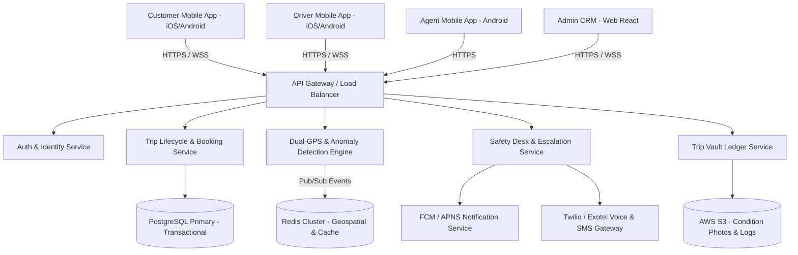

# MyDriver System Architecture & Engineering Plan

## 1. Executive Summary & Topology

MyDriver is a Trusted Driver-as-a-Service (DaaS) platform designed around real-time verification and accountability. The software ecosystem consists of four client applications backed by a highly available, event-driven microservices architecture.

---

## 2. Shared Backend Microservices Architecture

### Core Services Definition
1. **Identity & Auth Service**: Handles JWT token issuance, OTP verification, facial liveness recognition integration, and DPDP Act compliant consent management.
2. **Trip Lifecycle Engine**: Manages booking states (`REQUESTED`, `MATCHED`, `HANDSHAKE_PENDING`, `IN_TRIP`, `COMPLETED`, `ESCALATED`).
3. **Dual-GPS Integrity Engine**: Ingests WebSocket streams from both Driver App and Customer App. Runs geospatial co-location checks every 3 seconds.
4. **Safety Desk & Escalation Service**: Implements the L0–L5 escalation engine with automated voice calls, SMS dispatch, and live agent queue management.
5. **Trip Vault Ledger**: Implements immutable record-keeping of route polylines, telematics scores, condition photos, and timestamped events.

---

## 3. Database & Data Model Schema

### Primary Database: PostgreSQL (Relational)

#### `users` Table
| Column | Type | Description |
| :--- | :--- | :--- |
| `id` | UUID (PK) | Unique user identifier |
| `phone_number` | VARCHAR(15) | E.164 format, unique |
| `role` | ENUM | `CUSTOMER`, `DRIVER`, `AGENT`, `ADMIN` |
| `night_shield_certified` | BOOLEAN | Applicable for drivers |
| `mydriver_score` | DECIMAL(5,2) | Rolling driver behavior score (0–100) |

#### `trips` Table
| Column | Type | Description |
| :--- | :--- | :--- |
| `id` | UUID (PK) | Unique trip identifier |
| `customer_id` | UUID (FK) | Customer link |
| `driver_id` | UUID (FK) | Driver link |
| `status` | ENUM | Booking lifecycle state |
| `pickup_handshake_otp` | VARCHAR(4) | 4-digit verification code |
| `speed_ceiling_kmh` | INT | Customer-configured max speed |
| `mode` | ENUM | VisionCam mode (`MODE_R`, `MODE_D`, `MODE_F`) |

#### `telematics_logs` Table (TimescaleDB / Hypertable)
| Column | Type | Description |
| :--- | :--- | :--- |
| `timestamp` | TIMESTAMPTZ | Event time |
| `trip_id` | UUID (FK) | Active trip |
| `lat`, `lng` | DOUBLE | GPS coordinates |
| `speed_kmh` | FLOAT | Telematics speed reading |
| `accel_z`, `gyro_z` | FLOAT | Acceleration delta for harsh braking/cornering |

---

## 4. Real-Time Data Pipeline (Dual-GPS Verification)

1. **Ingest Phase**: Driver and Customer devices open persistent WebSocket connections (`wss://stream.mydriver.in/v1/integrity`).
2. **Evaluation Loop (Every 3 seconds)**:
   $$\text{Distance} = \text{Haversine}(\text{GPS}_{\text{driver}}, \text{GPS}_{\text{customer}})$$
   - If $\text{Distance} \le 150\text{m}$: Status = `VERIFIED`.
   - If $\text{Distance} > 150\text{m}$ for $> 60\text{s}$: Trigger `L1` Anomaly Event.
3. **Storage & Dispatch**: Streamed data buffered into Redis geospatial indices and asynchronously flushed to TimescaleDB for Trip Vault archival.
